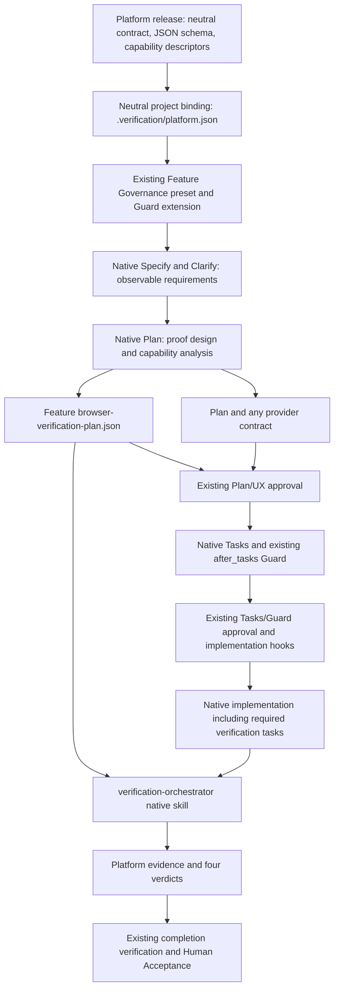

# Verification Platform — SpecKit Integration

Status: Integration design proposal, 2026-10-07. No integration is installed or enabled by this document.

This design defines **SpecKit as one process adapter** over the [Verification Platform baseline](verification-platform.md), using this repository's deployed governance overlays. The platform owns its neutral contract, JSON schema and binding; this adapter maps them to native stages, guards and approval fingerprints. SpecKit, `.specify`, Solo and their approval semantics are not platform dependencies. This document does not change runtime internals, product authority, SpecKit lifecycle or current approvals. All new paths and requirements below are proposed future integration surfaces unless explicitly identified as existing.

## Integration architecture

The proposal is feasible using the existing preset, extension and approval mechanisms. The deployed integration is not yet operational: no universal integration contract/schema, binding, JSON-plan requirement or associated approval checks are currently installed.

The overlay is the process adapter: it teaches obligations at specification and planning time, checks them at existing gates, and supplies an authorized artifact to the universal compiler later. The feature workflow owns this process's plan; the universal skill does not retroactively invent it. The platform accepts the same valid JSON from a caller that uses no SpecKit feature directory or approval registry. No new workflow stage, engine, adapter framework or integration-specific approval boundary is introduced.

### Responsibility split

| Owner | Integration responsibility |
| --- | --- |
| Verification Platform | Own/publish the Integration Contract, JSON schema/structural validation, neutral project-binding format and capability descriptors; consume valid JSON, resolved binding and caller assignment independently of their producer |
| Existing Feature Governance overlay | Reference that contract in native command addenda; conditionally require the JSON plan; validate coverage and capture of support needs through its existing read-only Guard |
| Existing Greenfield overlay | Continue to enforce approved architecture, ROADMAP scope and applicable UX authority; route any material change caused by testability requirements through its existing authority boundaries |
| Existing MVP overlay | Continue to reject unnecessary browser proof, duplicate proof and speculative diagnostic/control hooks; evaluate any justified support using its current budgets and reviews |
| Solo orchestrator | As part of this process adapter, bind neutral project/plan inputs into existing approval fingerprints and derive routing from current files; retain its existing hook order and HITL boundaries |
| Native feature stages | Specify defines behavior; Plan designs proof and required support; Tasks decomposes approved support and verification work; Implement delivers that work |
| Project | Select a pinned platform contract release, supply permitted execution configuration and any necessary project provider, preserve evidence under existing acceptance practices |

The SpecKit-specific mapping belongs in the already installed `feature-governance` preset and `feature-governance-guard` extension. They already cover Specify/Plan/Tasks and post-tasks/pre-implementation review, including conditional Greenfield checks. The neutral binding is project-owned under the platform contract; it is not owned by that extension or installed into `.specify`. Greenfield and MVP retain their separate responsibilities. One set of command addenda and existing validation calls is sufficient; no separate adapter package/service or registration mechanism is needed.

The execution topology is independently fixed by the platform: Codex, Node/Playwright Test and run-scoped bridges in WSL → Windows Chrome, PowerShell and UIA. This adapter can validate that assignments fit that supported topology, but does not implement path conversion, Windows process discovery, CDP relay or native subprocess lifecycle. Those mechanics belong to the platform's host runtime adapter. The JSON plan describes required environments/proof; volatile Windows transport settings remain in the execution assignment. No alternative host topology is selected or designed here.

## Deployed mechanisms establishing the insertion points

The following current files materially establish the design. Registry metadata identifies installed components; the command/skill bodies and Python functions establish the actual artifact and approval behavior. No workflow or guard was executed during this design work.

| Existing source | Relevant observed mechanism | Integration use |
| --- | --- | --- |
| [Project instructions](../AGENTS.md), [SpecKit governance instructions](../.agents/governance/speckit/AGENTS.md) | SpecKit work uses runless Solo, current artifacts and human approval facts; workflow runs/stage cursors are prohibited | Preserve this adapter's runless routing and native stages without imposing them on the platform |
| [SpecKit install manifest](../.specify/integrations/speckit.manifest.json), [Codex install manifest](../.specify/integrations/codex.manifest.json) | Recorded SpecKit/Codex integration version 0.16.2; native commands are exposed as project Codex skills | Install integration instructions through the normal preset/command composition mechanism, not by manually patching generated skills |
| [Preset registry](../.specify/presets/.registry), [extension registry](../.specify/extensions/.registry), [bundle record](../.specify/bundle-records.json) | Existing local Feature Governance, Greenfield, MVP and Solo components; presets declare prepend/append command layers | Extend their maintained sources and normal installation metadata later; no new governance repository is necessary |
| [Feature Governance preset](../.specify/presets/feature-governance/preset.yml), its [Plan addendum](../.specify/presets/feature-governance/commands/speckit.plan.md) | Adds specification/planning/task governance; commands load policy from the installed native Guard extension | Put project-facing verification obligations alongside this existing native policy, referencing platform-owned resources |
| [Greenfield Plan addendum](../.specify/presets/greenfield-governance/commands/speckit.plan.md), [Tasks addendum](../.specify/presets/greenfield-governance/commands/speckit.tasks.md) | Plan determines `COMPATIBLE` versus `BASELINE_CHANGE_REQUIRED`, creates conditional design artifacts, and preserves downstream work on reconciliation; Tasks consumes approved design | Treat the JSON proof plan as another conditional planning artifact; route support design through the same compatibility checks |
| [Deployed Plan skill](../.agents/skills/speckit-plan/SKILL.md), [Tasks skill](../.agents/skills/speckit-tasks/SKILL.md) | Phase 0 research/Phase 1 contracts and quickstart precede Tasks; verification budgets require the lowest sufficient layer and justification for elevated proof/hooks | Create the JSON in Planning after requirements and applicable UX decisions are settled; justify any internal support before decomposition |
| [Guard command](../.specify/extensions/feature-governance-guard/commands/speckit.feature-governance.review.md), [hook configuration](../.specify/extensions.yml) | Mandatory read-only Guard after Tasks and before Implement; no `before_plan` or `after_plan` hooks currently configured | Extend the existing Guard's conditional review, rather than relying on a nonexistent planning hook or adding another gate |
| [Solo Implement prepend](../.specify/presets/solo-orchestrator/commands/speckit.implement.md), [readiness skill](../.agents/skills/speckit-solo-orchestrator-readiness/SKILL.md) | Mandatory order is Guard → MVP Preflight → Solo Readiness → Core implementation, with explicit human readiness approval | Make proof-plan validity and support capture prerequisites of the existing order; keep reviews fresh |
| [Solo script](../.specify/extensions/solo-orchestrator/scripts/solo.py): `plan_ux_inputs`, `review_inputs`, `review_fingerprint`, `next`, `readiness` | Plan/UX approval binds an explicit list plus `contracts/` and `design/`; Tasks/Readiness add task scope; task checkboxes are normalized; missing/stale approvals route back to existing boundaries | Add the feature-root JSON and platform binding to the relevant approval inputs and stale/missing-artifact handling |
| [Governance-facts contract](../.specify/extensions/greenfield-foundation/docs/governance-facts.md), [shared validator](../.specify/extensions/greenfield-foundation/scripts/governance_facts.py), [current registry](../.specify/governance/hitl.json) | Human decisions bind project-relative file inputs/fingerprints; no procedural progress storage. Human Acceptance includes evidence and conservatively hashes the project outside `.specify`/`.git` | Use existing records; explicitly identify the neutral binding and required evidence as inputs. `.verification` is already included by acceptance tree hashing, but omitted by current Plan/Readiness lists. |
| [Completion verification command](../.specify/extensions/greenfield-roadmap-lifecycle/commands/speckit.greenfield-roadmap-lifecycle.verify.md) | Runs required feature checks, supplies evidence paths and `--verification PASS` to the existing lifecycle evaluator; does not grant Human Acceptance | Consume platform results as required evidence; never translate unresolved verdicts into completion PASS |

The native [setup-plan](../.specify/scripts/bash/setup-plan.sh) resolves the feature directory, and [setup-tasks](../.specify/scripts/bash/setup-tasks.sh)/[check-prerequisites](../.specify/scripts/bash/check-prerequisites.sh) expose known artifact lists. Those lists currently omit the proposed JSON. Addenda must explicitly derive `<FEATURE_DIR>/browser-verification-plan.json`; its discovery must not depend on `AVAILABLE_DOCS` automatically including new filenames. There is no need to replace the native feature-context resolver.

Existing feature practice places `spec.md`, `plan.md`, `quickstart.md`, contracts, tasks and evidence together under `specs/<feature>/`. For example, the [current feature Plan](../specs/002-save-site-personalization/plan.md) and [quickstart](../specs/002-save-site-personalization/quickstart.md) already prescribe later browser proof and record it in feature evidence. This establishes placement and a handoff opportunity, not permission to migrate that feature in this task.

## Project-facing contract and delivery

### Platform-owned contract

The universal platform canonically maintained in the dedicated `ahhakopian/verification-platform` repository (with intended local working directory `~/tools/verification-platform/`) publishes the following two normative resources as part of its one repository-scoped release/distribution:

- `contracts/verification-integration.md`: the Verification Integration Contract for consuming development processes.
- `schemas/browser-verification-plan.schema.json`: the single machine-readable proof-plan schema.

These are platform distribution resources, not files installed today. The platform baseline establishes ordinary repository-scoped `vMAJOR.MINOR.PATCH` tags/releases covering these resources, generic capability descriptors, runtime and both frontends together. SpecKit is downstream of that release; the relevant governance/overlay repositories maintain this process adapter, never the universal contract/schema, generic capabilities, runtime or platform release identity. Their ownership, neutral binding and validation contract are defined in the platform baseline, independently of SpecKit. An overlay may carry an unchanged, identifiable resource snapshot without owning the contract. The entire architecture document and runtime need not be copied into each project, and planning need not install or launch the verification runtime.

The contract establishes only these consuming-project obligations:

1. Classify browser/native-runtime proof applicability from current requirements and approved proof obligations. Frontend file changes alone are insufficient.
2. When such proof applies, supply a valid JSON plan before compilation, trace its claims to governing sources, and retain all mandatory proof.
3. Resolve proof needs against the pinned generic capability surface. When it suffices, add no application verification hooks or provider requirement.
4. When proof needs a genuine internal observation/control, identify the smallest required provider contract and disclose its provenance/effects before treating that support as available.
5. Supply an exact plan/binding identity and caller authorization; maintain consistency with governing behavior and proof. Approval mechanics, where required, remain the producing process's responsibility.
6. Supply the approved JSON identity and explicit provider/fixture configuration to the later orchestrator. Runtime availability must be checked then, not presumed from a planning classification.
7. Preserve required evidence and unresolved verdicts; neither automation success nor a human approval declaration manufactures proof.

The contract does not define SpecKit commands, ROADMAP concepts or a lifecycle engine. This adapter specifically requires Planning to create the JSON, support design to enter architecture/tasks, and existing approvals to bind those inputs. Those timing and governance obligations do not enter the universal contract. Application-specific terminology belongs in claims and optional provider payloads.

### One pinned project binding

This adapter requires the platform's canonical project-owned `.verification/platform.json` to pin one complete platform release: canonical repository/exact tag/source commit, release resource-index identity and digest, and indexed contract/schema/capability identities and required format versions. Its format and contents are owned by the platform baseline; no SpecKit-specific fields or duplicate binding are added. There is no `.specify/verification-platform.json`. The file remains usable if the project's development process changes. Direct platform invocation may instead supply the same resolved binding explicitly; this adapter uses a durable file so its native approvals can fingerprint the selection.

The maintained overlay's existing policy area can contain a compact `docs/verification-integration.md` mapping the neutral contract/binding onto SpecKit stages and guards. Preset addenda reference that native policy in the same way they currently load `feature-architecture-policy.md`; it does not duplicate or redefine the universal contract or schema.

The binding selects immutable resources. They can be resolved from an installed platform distribution or an exact resource snapshot carried by the existing Guard extension for offline planning. Both must match the declared release/source identity, pinned index digest and indexed resource digests; a snapshot retains the same index and required normative dependencies without becoming a separate release. Runtime and both frontends must later match that same platform release, rather than independently selected component versions. A missing resource, unsupported version or mismatch blocks the applicable planning/gate; the agent must not reconstruct a schema from memory or fetch an unpinned latest version. Runtime/provider exports are still validated later as required by the platform baseline.

Preset/extension installation supplies adapter instructions and any declared exact resource snapshot through the normal maintained bundle. The project selects its neutral binding explicitly; no overlay uninstall/reinstall may silently change that selection or its ownership. Generated `.agents/skills/**`, `.composed/**` and registry records are installation outputs, not alternate authoritative locations to patch manually. The currently inspected manifests do not already declare the adapter's consumed platform contract; normal installation must establish its supported resource relationship explicitly. This is an adapter consuming a platform release, never a reverse platform dependency on SpecKit, and no undocumented manifest dependency field is assumed.

External resource paths cannot be directly included in the current project-relative HITL input contract. Instead, approval binds the local release/digest selection, and each fresh validation checks that the resolved resources actually match it. An altered installed skill or schema cannot silently change the approved contract.

## Lifecycle of browser-verification-plan.json

The canonical path is `specs/<feature>/browser-verification-plan.json`, adjacent to `plan.md`. There is exactly one normative browser-proof plan per feature. `spec.md` and applicable UX/architecture authorities continue to define behavior; the JSON defines the approved browser-proof obligations for that behavior. A conflict returns to its owning authority, not to the compiler for interpretation.

The platform owns the single JSON browser-proof input format for every producer. This adapter chooses its feature-local path and Planning lifecycle, not its schema. `quickstart.md` may remain a human guide to prerequisites and invocations, referencing claim IDs in the JSON; it must not maintain a separate browser acceptance matrix with independent expectations. Ordinary unit/integration proof remains in existing artifacts and can be referenced without duplicating it as browser work.

| Native stage or boundary | Required integration behavior |
| --- | --- |
| Specify/Clarify | Define observable requirements and identify whether any required proof involves the real browser/native runtime. Record applicability with source references; do not invent capabilities or provider design in the Spec. Materially missing behavior follows existing clarification/authority routing. |
| Planning Phase 0 | Read the pinned contract/schema/descriptors; identify proof surfaces and gaps. Use existing verification-budget rules to separate browser-owned proof from lower-level proof. Unknown material feasibility becomes explicit research or an authority blocker. |
| Planning Phase 1 | Create/update the JSON and its proof obligations. Design any necessary project support in `plan.md` and, if useful, an existing `contracts/` artifact. Record capability sufficiency/dispositions in a compact Plan section. End with required structural and semantic checks. |
| Plan/UX HITL | Present the JSON together with Plan and applicable design. Existing approval binds it and the platform contract selection. No additional verification-plan approval boundary. |
| Tasks | Read the JSON explicitly and derive required support/configuration and execution/evidence tasks from approved Plan decisions. Annotate tasks with stable JSON claim/support references using the existing task syntax. No new decisions or speculative hooks. |
| Mandatory after_tasks Guard / Tasks-Guard HITL | Validate JSON, traceability, support coverage and compatibility against current files before existing Tasks/Guard approval. |
| Analyze / before_implement | Extend normal cross-artifact context to this conditional input; existing Guard checks it afresh, MVP Preflight assesses proof/support proportionality, Solo Readiness requires the current approval binding. |
| Implement | Deliver approved support and execute assigned verification tasks at their ordinary dependency position. A planned provider is not treated as already available. Native task marks describe progress; they do not mutate the normative JSON. |
| Verification / completion | Handoff to the platform skill from the existing verification task or required runtime-check interface. Reuse still-valid results. Existing completion verification checks required evidence and preserves Human Acceptance authority. |

Planning is therefore the correct creation stage: it already produces research, contracts and executable-environment guidance before Tasks and implementation readiness. Creation at Tasks would be too late to make support an approved design decision; creation at verification would be too late to plan testability.

For a feature with no irreducible browser/native proof, record a justified `not applicable` disposition in `plan.md`, bound by ordinary approval. Do not create an empty placeholder JSON or require a provider. The Guard verifies that disposition against current requirements. A changed requirement can make applicability stale.

### Minimal JSON requirements needed for integration

The complete schema is outside this task. The integration requires the following structural concepts so producers and gates know what they must preserve:

| Concept | Minimum obligation |
| --- | --- |
| Identity/version | Platform schema/contract and plan/source identity; this adapter additionally checks association with the current native directory and governing Spec without making a SpecKit feature/ROADMAP ID mandatory for other producers. No `approved: true` field as authorization. |
| Claims | Stable unique IDs, source references, expected behavior and required proof/evidence. Keep IDs for unchanged claims; explicitly account for replacements rather than silently dropping coverage. |
| Prerequisites and scenario/setup | Required states, permitted actions/setup constraints, relevant identities and claim/prerequisite references. References describe proof dependencies; no interpreted action steps or scheduler semantics. |
| Required environments | The environment variants required by governing sources; no invented extra browser/site matrix |
| Execution mode | Automated, assisted or human where the approved claim genuinely requires it; explicit unavailable capability/prerequisite information when applicable. Human involvement is not a fallback around a required automated/structured proof. |
| Capability/support needs | Required generic capabilities or namespaced project observation/control requirements and their limitations; a proposed support requirement is not an advertised implemented capability |
| Configuration references | References to the consumer's ordinary fixture/provider configuration and relevant setup documentation; planned paths can be tasked, but must exist at execution handoff |

Dependencies, references and IDs need structural validation, including duplicate/dangling references and contradictory prerequisite cycles. This validates metadata coherence; it does not construct or execute a DAG. Actual scenario sequencing remains ordinary generated TypeScript.

The JSON contains proof intent and static execution-mode/readiness dispositions, not mutable `PASS`/`FAIL` results or completion counters. Results belong to the platform's output contract. Necessary prerequisite or human-work descriptions remain visible rather than becoming silent skips. Source revision checks and the existing aggregate approval fingerprint bind related artifacts without requiring self-referential hashes between `plan.md` and its JSON.

### Updating and approval freshness

Plan owns JSON reconciliation when requirements, accepted proof, environment obligations or provider contracts change. Tasks and verification may identify a gap but must return it to Plan when it changes proof design; they cannot weaken it locally. A changed product expectation returns to Spec/PRD, and a material architecture change returns through the existing controlled change procedure.

Reconciliation preserves completed task IDs/marks, implementation and historical evidence, as current Plan/Tasks addenda already require. Evidence is reusable only for the behavior/environment it actually proved. The new contract is not applied retroactively to completed features merely to populate JSON files; an active feature is reconciled at its existing governed boundary when adoption is authorized.

The root JSON and neutral binding are not currently included by Solo's `plan_ux_inputs`. That function reads named Markdown inputs and recursively includes `contracts/`/`design/`; referencing JSON in Markdown does not hash its contents. This adapter must explicitly add the JSON and `.verification/platform.json` to Plan/UX, Tasks/Guard and implementation-readiness input sets. Any normative project-provider contract already in `contracts/` is covered by the existing traversal. A referenced provider-configuration declaration outside those directories must also be explicitly bound if its contents determine allowed proof/configuration.

Keep executable provider implementation, live configuration values and result files out of readiness scope. The current readiness model authorizes design/task scope and deliberately ignores normal source/test/evidence changes. Bind the provider declaration or stable configuration selection at planning, then bind actual provider versions/build/configuration at execution through the existing platform manifest and evidence contracts.

Solo's current `next` can reach Plan/UX approval from an existing Plan without executing Plan when approval is merely missing. Consequently, checking only the Plan command's completion is insufficient. Before presenting/recording Plan/UX approval, the integrated path must validate applicability and required JSON/binding presence; missing required artifacts route to native Plan reconciliation rather than approval of an incomplete input set. The existing boundary remains `plan-ux`. Changes to the relevant artifact set invalidate downstream approvals and route back through current boundaries; they never require a persisted workflow cursor.

## Testability analysis and implementation readiness

Record a compact `Verification Integration` section in `plan.md`: applicability, canonical JSON path, contract binding, capability dispositions, any required support design, and ordinary fixture/provider configuration references. Use the existing `Verification Justification` and `Architecture Justification` sections for actual proof/support reasoning; do not add a separate readiness report or support backlog.

| Finding during Planning | Required disposition |
| --- | --- |
| Required proof available through generic capability contracts | Name the actual capability/source and relevant constraints. No application hooks/provider tasks. Ordinary external runner/configuration tasks may still be needed. |
| Existing project diagnostic already provides required evidence | Reuse it, with a minimal provider adapter only if the platform needs that binding. Identify the real observation boundary and any observer effects. |
| Required internal observation/control absent | First confirm the browser-level claim adds necessary proof and lower-level/generic sources cannot satisfy it. Design a namespaced provider operation, inputs/outputs, provenance, allowed effect/lifetime and cleanup; add approved support tasks. |
| Generic capability missing from the assigned platform | Record an external platform/configuration dependency or blocker. Do not add product instrumentation solely to compensate for an unrelated missing UIA/CDP helper. Platform work belongs to its owner unless separately authorized. |
| Material feasibility unknown | Resolve what is necessary for a credible design through bounded research. An approved early feasibility task may precede dependent implementation only when its stop condition is concrete and no unresolved product/architecture decision is delegated to execution. |
| Human proof required by the governing criterion | Preserve that explicit obligation and its required human evidence. Do not call automation or a human declaration proof of a different criterion. |

These dispositions follow the deployed MVP defaults: test-only hooks are zero unless necessary proof cannot be established below; higher-cost browser proof must establish a specific additional property. A safety-sensitive internal invariant alone does not justify browser instrumentation. Conversely, a fixed approved native/browser proof obligation cannot be silently replaced by a unit test. A proposed change of proof method returns to the design owner and current approval process.

Support enters feature-local architecture first, then tasks. If it changes product scope/ownership or the approved baseline, existing Greenfield routing blocks that feature-local decision until upstream authority is reconciled. Universal integration adoption does not automatically authorize product changes.

### What gates implementation

For an applicable feature, the existing gates require:

1. The correct feature JSON exists and resolves against the pinned supported schema; identity, references, prerequisites and required configuration declarations are valid.
2. Claims cover the applicable approved browser/native proof without contradictions, omissions or invented acceptance cases. This is semantic review, not merely schema validation.
3. Required generic proof sources are identified honestly, and every missing project capability has an approved minimal design and traceable tasks. External prerequisites and uncertainty have explicit dispositions; no necessary support is left to the later skill to discover.
4. Support/configuration tasks precede their dependent verification tasks using normal task ordering, and fit existing architecture/verification complexity justification.
5. Current Plan/UX, Tasks/Guard and implementation-readiness approvals bind these inputs; fresh Guard and MVP Preflight still pass.

The existing Guard performs SpecKit semantic checks and calls platform-owned binding/resource and structural plan validation. The platform validator requires no `.specify` context or Solo import. The same small validation function can be called at Plan completion and approval/handoff checks; it is not a new SpecKit command or gate. Process-specific decisions are recomputed, not stored as guard success facts. Schema validity cannot authorize missing behavior.

Implementation readiness does **not** require a tasked project provider to be implemented already. That would create a circular gate. It requires a complete approved design and work coverage. Execution readiness later requires actual callable exports, types, prerequisites, runtime availability and permitted actions, following the platform baseline. A well-planned external outage can block verification without invalidating implementation scope; an unresolved critical design choice cannot be dismissed as a runtime outage.

No additional `before_implement` hook is needed: extend the existing Guard at priority 5, retain MVP Preflight at 10 and Solo Readiness at 15. Update Solo's input selection/freshness checks through its maintained integration source. Its native hook-order enforcement stays unchanged. Do not run a second Guard merely to inspect the same JSON.

## Handoff and return through existing verification work

The project invokes `verification-orchestrator` through a native Codex skill call from an already-defined verification/evidence task, or from the completion verification interface when that required proof is still unresolved. It is not a new Solo routing stage. A capability or compiler skill that is not installed produces an explicit blocker; documentation must not pretend the new route is operational.

The invocation supplies:

- Explicit canonical JSON path, resolved by this adapter from the current native feature context. The adapter checks feature identity and the linked ROADMAP entry before handoff; feature-directory/ROADMAP context stays with the adapter and is not a required compiler input. No latest-feature scanning occurs.
- The JSON digest and resolved neutral contract/schema binding. This adapter validates current project approval fingerprints before handing off caller authorization tied to that exact plan/binding. A process approval reference may be attached as provenance; the compiler neither opens `.specify/governance/hitl.json` nor requires or interprets Solo approval semantics.
- The consumer's existing platform fixture/configuration entry and explicit provider module/version configuration, or a generic-only configuration when no project provider is required. References are declared during Planning and realized by their ordinary tasks.
- The platform's normal caller assignment within WSL → Windows: actual environment/build, Windows Chrome runtime/attachment, account/site selection, allowed effects, ownership/cleanup, existing evidence and output location. Volatile endpoints and secrets are supplied at invocation, never embedded as normative planning state; Windows discovery/transport remains the host adapter's work.

The handoff is a transient invocation object, not another mandatory repository manifest. The platform's generated coverage manifest remains its existing execution artifact. The JSON proof plan is the input authority; the generated test is not fed back as a new feature specification.

Current feature documentation already names the installed browser-verification skill for real browser evidence. Later adoption must reconcile the relevant Plan/quickstart/task instructions to name the compiler and configured deterministic mode while preserving the existing browser-verification infrastructure and its ownership policy. This is an explicit integration change at the normal feature boundary; merely installing the compiler does not override current instructions or bypass a mandated review.

Results return through the task's existing evidence mechanism. The completion caller reads the platform result JSON and evidence references, rather than treating a green Playwright exit or file existence as verification success. Automated claims must have valid proof; explicitly human claims require their accepted human evidence as well. An absent required result, `FAIL`, `BLOCKED` or `INCONCLUSIVE` prevents required verification from being represented as lifecycle `--verification PASS`. The platform never grants Human Acceptance or marks ROADMAP DONE.

The completion interface preserves the current evaluator flags/evidence arguments and requires current plan/binding identity plus complete applicable claim coverage. It also checks that required project support is actually delivered, where applicable. Fixable missing support already within approved design can follow native corrective-task/convergence behavior; new proof/product/architecture decisions return upstream. Do not invent a parallel verification lifecycle.

Use caller-owned disposable output locations for generated tests and transient reports. Publish required stable result/evidence through current feature evidence practices, with project-relative paths passed to Human Acceptance. The current acceptance tree hash already covers `.verification/platform.json` because only `.specify`/`.git` and specific evaluator transients are excluded. Also list the neutral binding explicitly as an acceptance input to identify the normative contract selection. All required published evidence files remain explicit inputs. Changing execution outputs inside the accepted tree after approval makes acceptance stale; this adapter respects the current exclusions without changing them.

## Minimal project additions and necessary bindings

| Artifact/binding | Requirement |
| --- | --- |
| `.verification/platform.json` | Platform-owned neutral binding format with a project-owned release selection; this adapter includes it in design/readiness/acceptance inputs, without a second SpecKit binding |
| `specs/<feature>/browser-verification-plan.json` | Only for applicable features; normative browser-proof intent, created/maintained by Plan and bound into existing approvals |
| Existing `spec.md` and `plan.md` | Applicability/source references; Plan's compact integration disposition and support/configuration design; no duplicate verification matrix |
| Existing `contracts/` | Optional project-provider declaration only when required; no empty provider artifact for generic-only proof |
| Existing `tasks.md` | Required support/configuration, prerequisites, verification and evidence work with claim/source references; normal syntax and preserved progress |
| Existing platform runtime/fixture/provider configuration | Reuse the baseline's consumer configuration, supplied by normal tasks. Its stable declaration is bound where normative, and its actual version/configuration is recorded at execution |
| Existing `.specify/governance/hitl.json` | Existing boundary/subject/input/fingerprint objects; no new root fields, workflow state or verification approval category |
| Existing evidence mechanism | Platform result and supporting files referenced by current feature evidence and completion inputs; no integration-specific evidence database/report format |

Adoption requires one platform-neutral project binding and one conditional feature artifact, not a new SpecKit configuration namespace. This adapter extends references and input sets in existing artifacts/interfaces. Optional provider implementation, runner setup and execution outputs already belong to the platform baseline; they are not additional integration subsystems. No host-specific wrapper is added to a feature or governance overlay.

## Corrections to the proposed model

| Correction | Reason in this deployed environment |
| --- | --- |
| Use command preset composition plus existing extension policy/Guard, rather than a new workflow | Solo is explicitly runless, and the deployed presets already teach obligations to native Codex skills. Workflow manifests/runs are not the integration surface. |
| Create JSON in Planning and bind it into existing Plan/UX approval | Planning already owns proof budgets/contracts; the current root JSON would otherwise escape Solo's explicit input list. |
| Teach early, enforce at existing approval and Guard/Readiness boundaries | There is no currently registered planning hook, and an existing Plan can reach approval without being regenerated. Creation instructions alone are insufficient enforcement. |
| Separate development readiness from later execution readiness | Required project support must be approved and tasked before implementation, while actual exports cannot be required before they are implemented. |
| Analyze proof necessity before adding hooks | Deployed MVP rules prohibit machinery merely to support unnecessary higher-level proof; generic capability gaps do not automatically justify product instrumentation. |
| Pin small platform resources through a project-relative binding | Avoid copying the whole platform design, avoid mutable global-skill authority, and satisfy the current approval validator's project-relative input restrictions. |
| Make the binding `.verification/platform.json`, with SpecKit only reading and fingerprinting it | Contract/version selection is universal project configuration, not SpecKit state. The neutral path works with current project-relative validators and is already covered by acceptance tree hashing. |
| Keep the sole WSL → Windows host bridge in the platform library | This process adapter maps stages/approvals, not host deployment. Its existence neither broadens topology support nor creates a Windows service. |
| Invoke the platform within existing verification tasks/interfaces | Preserve the current lifecycle and completion/HITL authority; the universal skill compiles and proves, not governs SpecKit. |

The two documents now assign JSON/schema/binding ownership to the platform and SpecKit lifecycle/fingerprint behavior to this process adapter. This revises the earlier SpecKit-only binding and JSON-selection wording without changing capability, evidence, verdict or project-provider semantics. The platform's one host implementation is independently constrained to WSL → Windows.

## Remaining decisions and bounded checks

1. **Overlay maintenance source:** confirm the maintained source for the installed local preset/extension bundle, and verify that a future normal installation composes the addenda into native skills without dropping current Greenfield/MVP/Solo rules. Installed metadata alone does not establish a successful future reinstall.
2. **Shared validation entry:** choose the concrete structural validator API and minimal schema fields, preserving one validator/schema contract for producer, gates and compiler; no new guard command is needed.
3. **Activation and reconciliation scope:** identify the authorized active-feature adoption point and any genuinely necessary upstream architecture approval. Existing completed features and current approval facts must not be migrated or rewritten automatically.

These are integration publication/adoption checks, not unresolved browser-driver questions. Browser/native empirical work remains governed by the platform baseline and applicable feature plans. This document creates no implementation plan and performs no independent consistency audit.
