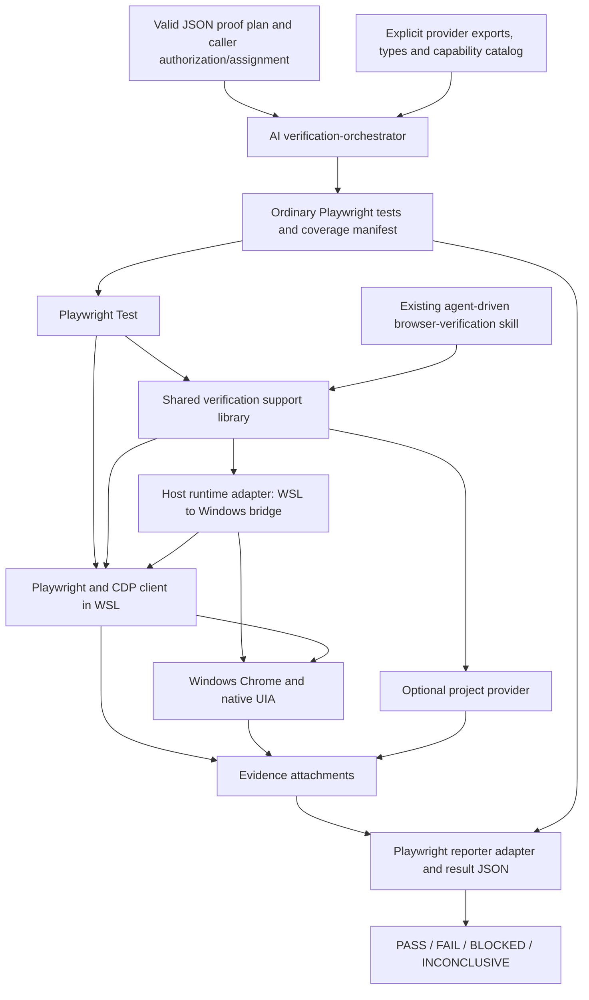

# Reusable verification platform

Status: Architecture design, 2026-10-07; canonical ownership and release model established below. No implementation is delivered by this document. The [host-runtime experiment](verification-platform-host-runtime-experiment.md) is established PASS evidence for its tested teardown/reconnect paths only.

This document defines verification infrastructure independent of the application and its development process, with one intentionally supported execution topology: a WSL-hosted Codex/Node runtime controlling Windows-hosted Chrome and native UI. It sits alongside the [Personalizer architecture baseline](baseline.md); it neither revises that product authority nor completes a ROADMAP feature. The current Personalizer T012 task is a motivating stress case, not the platform's data model or acceptance specification. Adoption into a governed project remains that project's decision.

## Purpose and architectural shape

The platform compiles a valid, caller-authorized `browser-verification-plan.json` into ordinary TypeScript `@playwright/test` tests, runs them against explicitly selected environments within the supported topology, and returns evidence-backed `PASS`, `FAIL`, `BLOCKED`, or `INCONCLUSIVE` results. It supports web content, Chrome protocol/extension observations, native Windows UI, and optional application diagnostics or controls. Future projects normally supply a plan and configuration; new observation or control needs may require a provider. A project's process may require plan approval; the platform does not require any particular approval system.

| Architectural axis | Scope |
| --- | --- |
| Application/system under test | Application-independent generic capabilities, with optional project providers |
| Development process | Platform-owned contract and JSON input; SpecKit is one consuming process adapter |
| Execution topology | WSL-hosted Codex, Node/Playwright Test and bridge processes → Windows-hosted headed Chrome, PowerShell and UIA only |

Pure Linux, a pure Windows Codex/runtime, macOS, containers, remote hosts and other topologies are out of scope. Project independence does not imply host portability. Another topology would require replacing/reimplementing the host runtime boundary; no additional host implementation is designed here.

The plan remains normative. Generated code, a coverage manifest, and execution reports are derived artifacts. Neither capability availability nor a successful automation command can reduce the required behavior or proof. The platform does not approve product behavior, change acceptance criteria, authorize external actions, or decide project completion.

One maintained Verification Platform product contains two frontends, `browser-verification` and `verification-orchestrator`, over a small shared support library reusing existing browser-verification infrastructure. Fixtures, provider metadata, evidence records and the Playwright reporter adapter are responsibilities inside that library, not separate services. Playwright supplies execution and browser automation. Files in its output directory supply evidence storage. There is no workflow engine, interpreted action language, second driver, evidence database, desktop overlay, or multi-agent execution hierarchy.

The design follows the supplied pattern attributed to `Ruclo/thesis-artifact`'s `v2-generate-pytest`: discover real capabilities before generating tests and never invent helpers. That project is an inspiration, not a runtime dependency. The exact referenced upstream file has not been independently established by the available research; the pattern used here is explicitly supplied in the design brief.

## Responsibility boundaries

| Component | Owns | Does not own |
| --- | --- | --- |
| Caller and normative plan | Claims, expected behavior, accepted proof sources, scope, allowed effects, environment matrix, prerequisites and cleanup authority | Implementation details of generic browser helpers; automatic approval from a green test |
| Process adapter, where used | Map a development process to the platform contract; verify that process's approvals/freshness; supply an authorized plan and assignment | Own the universal schema/binding, impose its lifecycle on other callers, become a runtime dependency |
| AI verification-orchestrator skill | Read plan and assignment, discover registered exports, choose valid proof surfaces, generate ordinary tests and complete claim coverage mapping, invoke the configured runner, explain returned results | Invent capabilities, reinterpret product intent, weaken proof, act as a driver for every test action, grant permissions, edit product code to make verification pass |
| Playwright Test | Test/fixture lifecycle, assertions, deadlines, steps, standard reports and attachments | Native UI implementation, application semantics, four-verdict interpretation by itself |
| Shared verification support library | Attachment/ownership fixtures, typed adapters to existing helpers, capability descriptors and readiness checks, bounded event observation, evidence metadata and one reconciliation implementation used by frontend/reporting adapters | A custom test interpreter, scenario state machine, automatic fallback or semantic verdict decisions based only on helper success |
| Host runtime adapter within the library | Windows Chrome/process/profile/listener validation, current CDP route and WSL transport, PowerShell/UIA invocation, incarnation checks and disposal of owned bridge resources | Claims, verdicts, project semantics, process approvals, a second CDP client or persistent Windows service |
| Generic providers in the library | Browser-independent infrastructure where applicable, Chromium/CDP observations and actions, Windows UIA operations, optional visual operations | Application vocabulary, expected product state, account/site defaults, implicit browser/profile selection |
| Optional project provider | Actual authoritative application observations and explicitly permitted controls, with its own types and descriptors | Generic browser implementation, redefining approved acceptance, synthesizing success evidence |
| Reporter adapter | Reconcile manifest, claim records, Playwright results and attachments; retain execution errors; produce complete result JSON and summary | Infer missing evidence from screenshots, execute retries, silently discard unresolved claims, approve project completion |
| Existing browser-verification skill | Bounded agent-driven browser assignments, routing and existing interaction policy | A second implementation of generic helpers or ownership of the platform's normative plans |

The existing skill's agent routing remains specific to agent-driven assignments. The new orchestrator does not create a browser worker per generated test. Deterministic runs call the library directly. A later extension of the browser-verification skill can expose this execution mode while retaining its current agent mode and rules.

## Canonical source ownership and publication

The canonical repository is the dedicated GitHub repository `ahhakopian/verification-platform`. Its intended local working directory is `~/tools/verification-platform/`; `~/tools/` is a parent directory containing independently versioned repositories, not a monorepository. The canonical GitHub repository's existence is not established by this documentation. The dedicated repository keeps both frontends, their shared implementation and normative resources together. SpecKit governance and overlay sources remain in their separate existing repositories and consume published neutral platform releases through the process adapter.

The layout below describes ownership, not mandatory directory names or a migration instruction:

| Inside `ahhakopian/verification-platform` | Outside the platform boundary |
| --- | --- |
| Universal integration contract, neutral binding format and browser-proof plan schema/structural validation | SpecKit stage mapping, presets, overlays, guards, approvals and other process adapters; maintained in their relevant governance/overlay repositories |
| Generic capability contracts/descriptors and typed provider/fixture interfaces | Application-specific providers, diagnostics, instrumentation and product semantics; maintained by consuming projects |
| Shared verification runtime, generic browser/CDP/native capabilities and the sole supported WSL → Windows host implementation, including its Python/PowerShell assets | Consumer plans, fixture composition, execution assignments, accounts/secrets and project runner configuration |
| `browser-verification` and `verification-orchestrator` frontends/skills using that shared implementation | Generated tests, execution manifests, reports and evidence retained by callers |
| Evidence/reporter/finalization support, platform tests and platform documentation | Other reusable tools in `tools`; third-party Playwright/Chrome implementations and caller-owned persistent browser/profile state |

The Git repository contains development source and history. A platform distribution contains the published platform-owned resources and usable frontend/runtime entries from one platform release, together with their required assets and declared compatible dependency identities/constraints. Consumers resolve those published entries rather than arbitrary source-tree paths or the current development checkout. A library/package entry is an access surface within this distribution, not another independently released product. No package registry, deployment service or repository-wide redesign is required.

### One platform release and resource index

Repository-scoped Git tags and matching GitHub releases use `vMAJOR.MINOR.PATCH`, for example `v0.1.0`, `v0.2.0`, and `v1.0.0`. These examples do not assert that any release already exists. Each tag identifies an exact commit in `ahhakopian/verification-platform`; its published distribution is one compatible set of contracts, schemas, generic capability descriptors, shared/host runtime, both frontends and evidence/reporter support. A release includes a resource index identifying its tag and source commit, normative resource IDs and format/contract versions, distribution-relative locations or public entries, and SHA-256 content digests. The index also identifies the published runtime/frontend content so an installed distribution can be checked against the same release.

The tag, index and published distribution are immutable after publication: do not move a tag, replace release content or reuse a release number. Corrected platform content receives a new platform release. The complete platform release is the compatibility unit; no subcomponent releases are introduced.

One platform semantic version is the initial compatibility unit. Patches preserve public contracts and supported behavior; minor releases add compatible capabilities; major releases change compatibility. Before `1.0.0`, a minor release may break compatibility and a patch remains compatible; exact pins are still required. Compatibility is assessed across the published platform set, including the supported dependency/host constraints. Consumers never mix platform-owned components from different releases, even when individual resource bytes are unchanged. Upgrades are explicit changes to the project binding, subject to the consuming process's existing approval rules.

Small internal format versions remain separate from the release number for parsing: the neutral binding, browser-proof plan schema, release resource index, capability/provider descriptors, generated coverage manifest and evidence/result envelopes. Capability contract version fields identify callable/observation semantics as already required below. These are format/contract identifiers, not independently published subcomponent semantic versions; unchanged formats/contracts keep their identifiers across releases. Generic provider implementation identity is the platform release. Third-party dependencies and project providers retain their own identities outside this release unit.

## Input and compilation contracts

### Platform-owned integration contract and neutral binding

The platform owns `contracts/verification-integration.md`, `schemas/browser-verification-plan.schema.json`, and its capability contracts/descriptors, published as small versioned resources from the maintained platform distribution. The integration contract requires traceable proof intent, early identification of unavailable capabilities or required project support, explicit allowed actions/configuration, and preservation of evidence limitations. It does not name SpecKit stages, `.specify`, Solo, ROADMAP or any approval registry. Those concepts belong exclusively to the [SpecKit process adapter](verification-platform-speckit-integration.md).

The canonical persisted project binding is `.verification/platform.json`, independent of any development-process directory. Its minimum release semantics are:

| Binding information | Required identity |
| --- | --- |
| Binding format | Small format version enabling interpretation of the binding itself |
| Platform release | Canonical GitHub repository locator (`https://github.com/ahhakopian/verification-platform`), exact `vMAJOR.MINOR.PATCH` tag and resolved source commit; no branch, range, `latest`, subtree, or development-checkout substitution |
| Distribution/resource index | Release-relative index/asset identity and SHA-256 digest of the index's exact bytes; the repository/release locator must suffice to obtain it without a development checkout |
| Integration contract | Exact normative resource ID within that index, such as `contracts/verification-integration.md` |
| Browser-proof plan schema | Exact indexed resource ID, such as `schemas/browser-verification-plan.schema.json`, and its small schema/format version |
| Generic capability descriptors | Exact indexed descriptor-set resource ID and format/contract identifiers; its release is the same pinned platform release, not a separate descriptor release |

These are required meanings, not a redesigned JSON schema. Indexed resource IDs are public distribution identities; their resemblance to source paths does not authorize source-tree imports. Normative resources include their referenced normative dependencies in the indexed, digest-checked set. Pinning one index digest transitively pins their content digests, avoiding redundant per-resource hashes in the binding. An offline resource snapshot must retain the same index and every normative resource needed for validation; an installed full distribution must likewise match the indexed frontend/runtime content. Local installation/cache paths are resolution configuration, never normative identity.

Resolution obtains the index from the exact named release (or a matching installed/offline copy), verifies its digest and release/source identity, then resolves resource IDs only through that index and checks their content digests and declared format/contract versions. Missing content, mismatched identities/digests or unsupported versions block use; there is no fallback to `latest`, a global skill installation or a development checkout. Runtime and both frontend installations must belong to the pinned platform release before compilation/execution. Planning may resolve only the normative resource subset without installing or launching the runtime.

The binding contains no workflow state, approval records, test results, secrets or live endpoints. Its local bytes and pinned index identity are sufficient for a process to fingerprint the normative selection; fresh resolution must still check external content against those pins. Resource resolution and structural plan validation belong to the platform; the process adapter adds its own traceability, architecture/task and approval checks.

The compiler receives an explicit plan path, resolved binding and caller assignment. It neither discovers a SpecKit feature nor imports its approval machinery. A direct/manual caller can supply the same binding values explicitly without a project binding file or registry; a process adapter may require the canonical file for its own durable approval rules. Other producers can supply the same JSON contract without adopting SpecKit. No adapter registry, plugin system or additional service is needed to make this boundary explicit.

### Normative plan and caller assignment

The normative executable-verification input is `browser-verification-plan.json`, validated against the single platform-owned schema regardless of its producer. Requirements/design sources may remain Markdown and be referenced by the JSON; they are not a second compiler input format. No action DSL is introduced. Each independently provable claim has a stable identifier, source reference, expected behavior and required proof, with prerequisites/setup and execution mode where applicable. The full schema is not redesigned here. Missing material expectations or proof obligations return to the plan owner; the compiler cannot make that product decision.

The accompanying caller assignment supplies concrete execution values. It can be ordinary JSON or TypeScript configuration, with secrets supplied separately through the project's existing mechanism. It realizes the plan's environment, proof, timing and effect constraints; it cannot replace accepted sources, relax proof obligations or expand permitted effects. Caller authorization may further restrict actions, leaving affected claims `BLOCKED`; it cannot remove those claims from required coverage. A material conflict returns to the plan owner before dependent generation. It includes:

| Information | Required meaning |
| --- | --- |
| Plan identity | Exact JSON revision/content digest and caller authorization; an approval reference is supplied when required by the caller's process and validated by that process adapter, never inferred from an arbitrary boolean |
| Required environments | Only the browser/platform/site/build combinations specified by the plan; every required combination is a separate coverage obligation |
| Attachment | Explicit Windows Chrome executable/profile/debug port/version, PowerShell route reachable from WSL and permission to reuse or launch; host adapter returns a current validated CDP endpoint |
| Selection | Intended contexts/pages/extension IDs, target criteria, URLs, native selectors and accounts; no generic project defaults |
| Actions and ownership | Permitted navigation, native interaction, permission changes, worker interruption, internal controls, creation/cleanup of resources, and persistent state changes |
| Provider configuration | Explicit local module/package imports and options, including any project provider; no automatic provider downloads or discovery from page text |
| Proof and timing | Accepted observation sources, event boundaries, bounded deadlines/observation windows and any existing valid evidence |
| Outputs | Execution output directory and retention/redaction expectations for collected evidence |

A healthy existing attachment is reused when assigned. Unavailable prerequisites produce `BLOCKED`; missing normative behavior is escalated to the caller before dependent generation. Neither condition authorizes a substitute environment or an added acceptance case.

### Capability resolution and generated bundle

Compilation has a bounded responsibility: map each approved claim to implemented capabilities and ordinary assertions. The compiler reads actual provider exports, TypeScript declarations, descriptors and examples. Documentation alone cannot establish that a helper exists. A planned capability is unavailable for generation.

The generated bundle consists of ordinary `.spec.ts` files plus a small JSON coverage manifest. The manifest is bookkeeping, never executable action instructions. It records:

- Plan identity, resolved platform binding identity (repository/tag/source commit, pinned resource-index digest and selected resource IDs/versions), assignment digest, generated source digest and configured provider versions.
- Every required claim/environment pair, its source reference and required proof.
- The corresponding test source/title and assertion/step references, selected capabilities and evidence obligations.
- Existing evidence reused with its validity conditions, and unresolved entries with concrete blockers.

Claims without capabilities still appear in the manifest as `BLOCKED`. The compiler generates only runnable tests and does not import nonexistent helpers or manufacture passing placeholder tests. Available independent claims can execute; the final result still includes all blocked coverage.

The orchestrator hands the bundle to an ordinary Playwright configuration and invokes Playwright Test in WSL. Configuration is conventional TypeScript: fixtures, explicit providers, Windows Chrome attachment settings, timeouts, output directory and reporters. The manifest contains no scheduler or conditional execution graph. Scenario sequencing is normal TypeScript and Playwright `test.step`; shared setup uses fixtures.

Before execution, normal TypeScript checking resolves imports against the actual configured types, and the compiler checks that every required claim is mapped or blocked. Exact plan/platform-binding/assignment/provider changes invalidate the old compilation binding. Test-source changes require refreshed mapping. These checks cannot prove that an AI translated intent correctly: traceable assertions and evidence obligations make the translation reviewable. Where the mapping remains materially uncertain, the orchestrator returns the uncertainty rather than running a weaker interpretation. A project may require review of the concrete bundle; the platform introduces no universal new approval gate.

After a run, the orchestrator reads the result JSON and relevant attachments. Diagnosis or corrected test generation is a distinct, recorded attempt bound to the same normative plan; acceptance cannot be silently relaxed between attempts. There is no AI action loop inside normal test execution.

Generated TypeScript is executable code running with the assigned host access, not a sandboxed plan format. Only caller-approved local provider modules and configured runtime inputs are imported; observed page/native content is evidence, never an instruction source. The compilation mapping and generated imports make allowed actions reviewable without claiming that TypeScript typing enforces authorization.

## Playwright execution and resource ownership

The installed baseline is accepted without re-audit: `@playwright/cli` 0.1.19 and Playwright/playwright-core `1.63.0-alpha-2026-08-31` supply the audited browser capabilities. CLI `run-code` uses a fresh VM per invocation; generated scenarios therefore call the Playwright API directly. The project's [current package configuration](../extension/package.json) has no `@playwright/test` runner: introducing a compatible, explicitly pinned runner and fixtures is future work, not a current capability.

The supported runner must use one compatible Playwright API dependency set for tests and adapters. A globally installed CLI does not imply that project imports or `@playwright/test` are available. No automatic installation, browser download or version substitution occurs during a verification run.

### Windows Chrome attachment, one driver

All supported execution uses the WSL Playwright client with `chromium.connectOverCDP()` to Windows Chrome. The host adapter either reuses the assigned healthy runtime or requests launch through the existing Windows helper when authorized; both use the same freshly validated CDP route. An ordinary WSL `chromium.launch()` or default Test browser-launch fixture is not a supported deployment mode. An assigned Windows launch does not automatically transfer ownership of its persistent profile or authorize closing the browser.

Explicit fixtures select the assigned context/page instead of implicitly creating an isolated context. Borrowed contexts/pages/profile are not closed or reset. Verifier-owned disposable pages or supported contexts may be created only when the plan permits them; their lifetime does not change the host topology.

Playwright documents CDP attachment as Chromium-only and lower fidelity than the Playwright protocol. The architecture therefore does not assume every normal runner feature is equally available over CDP. A claim's required feature must be available in its actual attachment; unsupported tracing, target access or event coverage blocks that proof rather than prompting a different browser. See [BrowserType API](https://playwright.dev/docs/api/class-browsertype#browser-type-connect-over-cdp).

For a persistent shared browser/native desktop, the configured baseline is one worker, no full parallelism and zero automatic retries. The same exclusive session cannot be mutated by the CLI agent and generated tests concurrently. A caller-provided exclusive assignment is sufficient initially; a distributed lock service is unnecessary. Any out-of-scope concurrent interaction observed during proof is recorded as interference.

Playwright may discard a worker after failure even with retries disabled. A replacement worker must perform fresh runtime validation and reconstruct its own connection; it cannot presume in-memory observers survived. Preconditions decide whether subsequent independent tests can run. Dependent tests either live in one ordinary scenario or use documented serial behavior; any tests skipped because of an earlier failure remain explicit unresolved coverage. Parallel execution is permitted only for genuinely independent, separately owned environments already allowed by the plan. See [Retries](https://playwright.dev/docs/test-retries) and [configuration](https://playwright.dev/docs/test-configuration).

Worker-scoped fixtures own the attachment and owned transport; test-scoped fixtures own observers, target sessions, handles and disposable pages. Test code uses standard `expect`, `test.step`, fixtures and `testInfo.attach`. It can use a borrowed `Page` just as ordinary Playwright code does. See [fixtures](https://playwright.dev/docs/test-fixtures).

### Cleanup is an explicit contract

The session records the Windows runtime incarnation, context/page ownership, owned relay processes, target sessions, observers and any permitted state restoration. All disposal is idempotent and bounded. Playwright-side cleanup removes listeners, detaches temporary CDP sessions, disposes handles, closes only owned disposable pages/contexts and disconnects the client; the host adapter then stops owned transport and bridge subprocesses. A borrowed browser process/profile, existing pages, accounts and permissions remain subject to caller-owned cleanup instructions.

The adapter uses the pinned Playwright API's connection-disposal behavior; it does not send Chrome CDP `Browser.close`. `browser.close()` for a connected browser is documented to disconnect and clear contexts created through that connection; `browserContext.close()` closes its pages, and the default context cannot be closed. Thus teardown must distinguish connection disposal from resource ownership and must not apply launched-browser teardown indiscriminately to an attached browser. The [host-runtime experiment](verification-platform-host-runtime-experiment.md) established Chrome/listener preservation using CDP-session detach followed by owned Node-client process exit and relay teardown; the separate `browser.close()` API path was not executed. See [Browser API](https://playwright.dev/docs/api/class-browser#browser-close) and [BrowserContext API](https://playwright.dev/docs/api/class-browsercontext#browser-context-close).

Unexpected disconnection invalidates live target sessions, handles and observers. Rediscovery can restore infrastructure for a later attempt, but cannot reconstruct lost evidence or repeat a side effect automatically. Browser restart as an assigned scenario action is distinct from driver recovery.

### Host runtime boundary: a library adapter with subprocess bridges

The shared library has one cohesive host runtime module for WSL → Windows. This is a replaceable code boundary inside the existing library, not a new deployable component. Universal claims, capability contracts, evidence requirements and verdicts remain above it. Windows paths, `wslpath`, PowerShell commands, process/listener checks and stream-process handles remain inside its configuration/implementation and actual runtime provenance; generated tests do not assemble those mechanics.

| Boundary responsibility | Existing implementation to reuse |
| --- | --- |
| Acquire/revalidate assigned Chrome | `browser-runtime.ps1` validates Windows executable/profile/version, headed process, listener ownership and PID/start-time/process-specific WebSocket incarnation; its `ensure` operation permits assigned launch only |
| Provide a current WSL-reachable CDP route | `browser-session.py` performs path conversion/discovery and owns a run-lifetime relay using Windows PowerShell stdio TCP streams; a validated direct WSL-to-Windows route may omit the relay but remains the same topology |
| Invoke supported native operations | `native-ui` calls Windows PowerShell using `wslpath`; `native-ui.ps1` inspects/selects/invokes UIA and revalidates runtime plus live elements before acting |
| Dispose host resources | Retain subprocess handles, use bounded/idempotent teardown for owned relay/stream/native invocation processes, and preserve caller-owned Chrome/profile. Playwright connection/session disposal stays above the boundary. |

The adapter returns a current endpoint with runtime provenance, a fixture-owned session/lifetime handle, and structured native observations or classified limitations. It supports revalidation and disposal; it does not publish a generic RPC protocol or host-adapter registry. Public generic/native capability methods delegate to it. Browser and target lifecycle events continue through Playwright/CDP in WSL; the relay moves bytes and is not a second browser driver.

The inspected [runtime contract](../../../.agents/skills/browser-verification/assets/wsl-windows-chrome-current.md) and scripts already follow this shape: the Python relay remains alive for the attachment, stream subprocesses belong to that relay, and native inspection/actions are separate PowerShell invocations returning JSON. The proposed Node wrapper must supply invocation deadlines and cancellation; the current native shell wrapper does not itself establish those guarantees. Native objects are reselected and revalidated within an invocation rather than retained between invocations. The launch mutex handles its current bounded launch arbitration; there is no demonstrated need for a resident ownership service.

The chosen mechanism is therefore a normal Node library/runtime adapter **with run-scoped subprocess bridges**, not a persistent Windows-side service. A process living for a verification run is not an always-on service. No current proof requires retained cross-call UIA objects or a separate Windows push-event transport; no such facility is added. The [2026-10-07 host-runtime experiment](verification-platform-host-runtime-experiment.md) established that clean relay SIGINT teardown and SIGKILL of an attached owned relay preserved the same assigned Chrome incarnation/profile/listener and permitted fresh Playwright reconnection; owned stream subprocesses drained without terminating Chrome. For these tested paths, Windows Chrome for Testing is caller-owned persistent runtime; Playwright clients, relay and stream subprocesses are run-owned disposable resources. Native UIA invocation cancellation and the separate Playwright `browser.close()` API path were outside this experiment.

## Shared capability library and providers

### Small, typed provider contract

A provider is a normal local module exporting implementations, TypeScript types, capability descriptors and, when needed, Playwright fixtures. The base library exposes generic fixtures; a project composes additional fixtures through ordinary `test.extend<ProjectFixtures>()`. Explicit imports are the registration mechanism. There is no plugin marketplace, arbitrary RPC dispatcher or universal tool-call language.

Tests call typed methods or ordinary Playwright methods directly. For example, a Chrome adapter takes the fixture's existing `Browser`, and a native adapter takes the validated runtime plus exact criteria. A project-specific `diagnostics` fixture can coexist in the same test. No universal platform change is needed to understand that fixture's application vocabulary.

The package's proposed public entries export a base `test`, ordinary Playwright `expect`, generic provider descriptors, adapter types and the reporter. The consumer's fixture module imports that base, extends it with its project fixtures, and exports the resulting `test`, `expect` and composed descriptors. The assignment names this fixture module; generated tests import it directly. This keeps fixture injection in Playwright and capability discovery bound to the same modules used in execution. Provider versions observed by fixtures must match the manifest; a mismatched composition blocks execution of affected claims.

The following are design contracts, not currently installed APIs:

| Contract | Fields/semantics |
| --- | --- |
| Provider descriptor | Namespaced provider ID, implementation/version identity, exported import/fixture entry, declaration location and implemented capability descriptors |
| Capability descriptor | Namespaced ID and contract version; actual callable export/fixture member; input/output types; supported browser/platform/attachment constraints; observations established and their limits; effects, ownership, required prerequisites and deadlines |
| Readiness result | `available` or `unavailable` for a selected capability in the assigned environment, with factual reason/limitation and evidence reference; availability is not acceptance proof |
| Operation observation | Raw source facts plus source identity, time/sequence, environment and correlation fields; command completion is identified separately from observed application effect |
| Observer lifetime | Start before the action; explicit ready acknowledgement, bounded wait/window, loss/overflow indication and disposal; no hidden persistent listener or silent truncation |

Descriptor, manifest and result-envelope formats carry `schemaVersion: 1`; capabilities additionally carry their own contract version. A claim is keyed by `(claimId, environmentId)`, a test by a stable generated `testKey`, and evidence by `(executionId, evidenceId)`. The generated test supplies `testKey` through a standard Playwright annotation and its evidence records. The reporter joins by these keys rather than parsing human-readable step titles. Unsupported format/contract versions are rejected, never reinterpreted. These are small metadata contracts; they do not specify an action grammar.

The catalog is derived from the explicitly configured modules. New providers need this small metadata contract so the AI can discover real operations; their method inputs and outputs remain their own typed APIs. Planned and experimentally unestablished operations must be labelled accordingly and excluded from normal available capability resolution. Operation-specific protocol support is checked against the assigned running browser, especially for experimental CDP domains; current online protocol documentation is not proof of installed support.

Readiness checks are bounded and non-destructive. Observation readiness can establish that the intended stream is subscribed, not that future evidence will necessarily be complete. Actions such as native invocation, permission prompts or worker stopping are not capability probes.

### Capability families and limits

| Family | Generic responsibility | Important proof limit |
| --- | --- | --- |
| Browser/page | Ordinary Playwright locators, actions, waits/events, frames/tabs, evaluation, accessibility snapshots, geometry and screenshots | A locator re-resolves; it is not proof of the same DOM object across calls. A rendered result alone does not prove internal authority. |
| Chrome/CDP | Exact extension/target discovery, fresh target selection, browser-level actions, target lifecycle observation, scoped network/worker observations and supported interruption controls | Target ID, extension tab ID, CDP frame ID and Chrome extension frame/document ID are separate namespaces. Conversion needs an observed mapping. |
| Windows native UIA | Intended-runtime root discovery, tree/inspection, exact unique selection, enabled/offscreen/pattern checks and supported semantic Invoke/ExpandCollapse | UIA operation success proves invocation. It does not establish Chrome callback data, product response or a physical mouse gesture. |
| Optional visual | Captured regions, deterministic image comparison or an explicitly allowed visual assessment provider | Visual similarity cannot silently replace semantic identity, event provenance or internal state. |
| Project provider | Application diagnostics and permitted controls with application-specific types | Diagnostics must observe the actual boundary; a test helper returning its expected value is not independent proof. |

The generic Chrome family can observe events Chrome exposes directly over CDP. It cannot magically subscribe to every extension API callback: `contextMenus.onClicked`, `runtime.MessageSender` and permission callbacks normally exist inside extension execution. Where those facts are required, an approved observer at the real callback/receiving boundary must export them, usually through the project provider or an already available extension diagnostic surface. Registering an additional listener or evaluating code in the extension requires declared support and permission; calling a handler directly does not prove a native click occurred.

`contextMenus.onClicked(info, tab)` supplies menu/tab/frame information, not a general exact DOM reference, and the documented `OnClickData` does not supply `documentId`. The Chrome-generated document identity seen at a real `runtime.MessageSender` boundary is a separate source. The current Personalizer code already uses callback correlation and sender tab/frame/document checks; making those observations available to tests is not the same as redesigning those product mechanisms. See [contextMenus](https://developer.chrome.com/docs/extensions/reference/api/contextMenus) and [MessageSender](https://developer.chrome.com/docs/extensions/reference/api/runtime#type-MessageSender).

### Lifecycle, network and permissions

Target observation starts before a relevant action and records creation, updates, destruction and attachment loss. Initial discovery and subscription must be reconciled to avoid an unnoticed discovery/subscription gap. A generic helper reports observations and fresh exact matches; scenario code decides which transition the plan expects. See the [CDP Target domain](https://chromedevtools.github.io/devtools-protocol/tot/Target/).

Worker interruption is a bounded Chrome capability, not a generic recovery subsystem: identify the assigned worker, observe the stop/destruction outcome, perform the separately assigned wake stimulus, and reacquire a newly matching target/session. Chrome decides revival. Old target IDs and worker memory are invalid. Debugger attachment, polling or API calls can alter worker lifetime; the provider must disclose observer effects, and an instrumented forced stop cannot establish uninstrumented idle suspension. Supported stopping primitives and non-perturbing observation remain empirical questions. See [extension service-worker lifecycle](https://developer.chrome.com/docs/extensions/develop/concepts/service-workers/lifecycle).

Network observations declare their coverage: which page/frame/worker targets, which sources, interval, subscription readiness and stream loss. Requests are keyed by source/session plus request ID, with actual initiator/frame/loader/document metadata when present. Matching a URL is not authoritative extension attribution. CDP worker requests can have an empty loader ID; CDP and extension document identifiers cannot be assumed equivalent. Chrome `webRequest` may add authoritative fields but requires suitable extension/host permissions and an available observer. The platform does not install an observer extension or grant extra permissions by default. See [CDP Network](https://chromedevtools.github.io/devtools-protocol/tot/Network/) and [Chrome webRequest](https://developer.chrome.com/docs/extensions/reference/api/webRequest).

An absence claim, such as no relevant network request, needs a plan-defined finite interval or observable completion boundary and complete coverage of the relevant sources. A quiet page stream while a worker stream is missing is `INCONCLUSIVE`, not proof of absence. Missing required observation capability before the attempt is `BLOCKED`.

Permission inspection and permission interaction are distinct. Structured state/events establish state; UIA can perform supported actual native prompt interaction when assigned. A granted state does not prove that a particular user prompt was displayed or acted upon. No automatic grant/deny policy belongs in the provider.

## Reusing browser-verification without a second implementation

An earlier installed `browser-verification` skill supplied implementation/design inputs; it is external to this repository and is not the canonical development or publication source. Consumers must configure the actual distribution location. Its policy and scripts were inspected as design inputs, without invoking browser execution or modifying the installed skill.

The installed bundle predates the platform and supplies existing implementation/design inputs; its installation directory is not the canonical development or publication source. Canonical maintenance belongs to the dedicated `ahhakopian/verification-platform` repository, checked out locally at `~/tools/verification-platform/`: `browser-verification` and `verification-orchestrator` are frontends of that product, and its shared runtime is the single source of generic capabilities and the one supported host implementation. This ownership decision requires no physical migration in this task. Library exports expose fixtures/adapters/reporter and their types; PowerShell/Python assets are included and resolved relative to the pinned platform distribution, not copied into each project. Generated project-independent tests import published library/fixture entries rather than an installed absolute skill path. Any later package name is an access choice, not an independent release identity; host portability remains out of scope.

Both frontends consume those implementations: Node tests import the adapters; the agent-driven skill continues using its CLI-facing wrappers. Current CLI rendering can continue serializing the same exported functions where a CLI VM needs self-contained code. The native and Windows runtime wrappers call the same scripts. There is no independently maintained test-runtime version of target discovery, Windows discovery, relay ownership or UIA matching.

| Existing artifact | Reuse and required adjustment |
| --- | --- |
| `scripts/extension-action.cjs` | Reuse `browserCDP`, `discoverTargets`, `selectTarget`, `discoverExtension`, `triggerExtensionAction` directly. Provide types and translate its structured error/cleanup observations at the adapter boundary. Keep `renderRunCode` as agent convenience, outside deterministic scenario execution. |
| `scripts/browser-runtime.ps1` | Host boundary: keep authoritative Windows Chrome executable/profile/version/headed-process/listener validation and process-specific endpoint discovery. No second Windows browser launcher. |
| `scripts/browser-session.py` | Host boundary: keep WSL relay and current endpoint lifecycle. Thin Node process-lifetime wrapper awaits readiness JSON, retains process handles, classifies failure and stops only owned transport. |
| `scripts/native-ui` and `scripts/native-ui.ps1` | Host boundary: retain exact criteria, unique matching, runtime/live-element revalidation and supported UIA patterns behind typed JSON/process operations. Extend root discovery only after live Chrome evidence establishes the root shape. |
| Existing browser-verification policy | Retain bounded claims, caller-owned configuration, no implicit fallback and ownership cleanup. Later document access to the same typed capabilities and deterministic mode; no installed skill edits are part of this design task. |

The current native root filter accepts `ControlType.Window`. That can miss a separately rooted `ControlType.Menu`; this is a known implementation limitation, not proof that Chrome's menu uses that shape. If experiments establish additional roots, extend the same root discovery implementation, preserve intended-runtime ownership, and revalidate unique live elements immediately before each action. No UIA server holding arbitrary native objects across calls is proposed. A scenario can inspect/expand/invoke through fresh exact semantic matches; persistent identity would require a demonstrated proof need and supported lifetime.

An `Extensions.triggerAction` command's success remains only an invocation observation. Its existing `type=tab` rule and exact target-selection behavior are retained; no guessed page/tab mapping, implicit focus, or native fallback is added. If the plan requires an actual toolbar interaction rather than this protocol action, use the required supported native operation or report its absence.

## Grounding and optional visual proof

Choose the lowest-cost source that fully establishes each required property, retaining valid existing evidence. Structured semantic state comes first; spatial claims use deterministic geometry; native UI uses structured UIA; vision is a last resort. This is a selection rule based on proof fitness, not a requirement to try every source in sequence.

For web content, ordinary Playwright grounding supplies locators, accessible roles/names, live snapshots and bounding boxes. When a claim requires exact node identity, retain an actual handle/reference in the relevant document and compare object identity inside that same execution context, or use an authoritative project observation that proves the same binding. A screenshot, matching selector, identical text or equal bounding box cannot establish DOM object identity. Navigation, replacement and detachment invalidate identity evidence. No synthetic attribute or page mutation is introduced solely to make selection appear stable unless the plan explicitly permits such instrumentation.

Real Playwright input is distinct from `dispatchEvent()` or direct product-handler calls. An `isTrusted` observation, a valid Chrome user-activation effect and physical native interaction are also distinct properties: use the actual event/effect required by the plan. The compiler cannot replace a required native action with a JavaScript invocation because the visible outcome is similar.

Geometry evidence records target identity, coordinate space, viewport, scale/device-pixel information and observation time. Relations such as overlap or bounds can be asserted deterministically. DOM coordinates and Windows screen coordinates are not interchangeable. Any supported crop/annotation maps those spaces explicitly; unknown mapping prevents a geometry proof.

Vision is optional for canvas/WebGL, inaccessible rendering or genuinely visual defects. Prefer an already-grounded target/region and crop over searching the entire desktop. Use ordinary Playwright screenshot comparison where the plan accepts it and the rendering environment is controlled. A semantic vision provider may be used only when the approved proof permits it; it declares input region, model/tool/version, response, uncertainty and limitations. Its control flow is a bounded provider call, not an AI browser-action loop. Nondeterministic model judgments remain identified as such; insufficient confidence is `INCONCLUSIVE`. They cannot overrule authoritative contradictory structured evidence.

No OmniParser, UFO², general desktop locator, or overlay dependency is required. Annotated screenshots are derived evidence with the original preserved; annotations do not create a semantic fact.

## Evidence and verdict contract

### Evidence records and claim coverage

Evidence is stored in ordinary Playwright output files and attachments. A small structured envelope references raw JSON, screenshots, traces or logs rather than duplicating them in a database.

| Record | Minimum content |
| --- | --- |
| Execution identity | Assignment digest, plan digest when supplied and generated-code digest when applicable; resolved platform binding identity (also recorded in the generated manifest); actual tool/provider versions; required environment and observed runtime/browser/build provenance; execution ID and attempt |
| Evidence envelope | Evidence ID, claim references, source/provider, event/time/sequence, selected target/identity fields with namespace, observation window and coverage/loss limits, attachment reference and content digest |
| Claim result | Claim/environment identity, expected/source reference, verdict, actual observations, assertion references, supporting evidence IDs, errors/limitations and reason |
| Summary | All required claim/environment entries, aggregate verdict, Playwright status/exit information, collection/cleanup errors and unresolved coverage |

Opaque live objects remain in fixture memory; reports contain their observable identities and comparison outcomes, never a serialized substitute for the object. Capture raw callback/sender values at their real source; correlation can join independently observed facts but cannot manufacture missing provenance. Event ordering uses source sequence/monotonic measurements where available; wall clocks across WSL/Windows/page/worker are not assumed synchronized.

Tests attach supporting observations before the assertion or in a failure-safe finalization path. They record an explicit per-claim completion only after the corresponding ordinary Playwright assertion and required evidence are available. A scenario that proves several claims may share the same evidence; the claim records identify which assertions establish each. This small evidence API records facts and verdict candidates, not test actions or expected-state evaluation. Assertions remain in generated TypeScript. A failed assertion is classified as a product failure only when the captured observation and proof source actually establish the contradiction.

The evidence fixture records when the relevant attempt starts, writes each observation/claim record to `testInfo.outputPath()` before attaching it, and flushes records as they are completed. It uses ordinary JSON files, not a journal service. A narrow assertion failure handler can record a contradicted claim with its actual/expected observation and evidence references before rethrowing the original Playwright error. An arbitrary exception outside that assertion does not mark the claim false. Provider failures include a machine-readable category, capability and phase (`readiness`, `action`, `observation`, `cleanup`); unclassified errors stay unresolved. No-record/crash cases retain uncertainty rather than guessing whether a side effect happened.

The shared library owns one reconciliation function: required claim/environment coverage and execution identity plus collected claim/evidence records, limitations and execution status in; validated per-claim results, aggregate verdict and complete result JSON out. The reporter adapts Playwright test results, claim attachments and the manifest to this function; crash finalization uses the same function with already flushed records. The agent-driven `browser-verification` frontend uses the same evidence/result contracts and reconciliation for its bounded assignment, without inventing a second verdict implementation. A bounded assignment result cannot represent plan-wide verification unless it accounts for every required plan claim/environment pair. None of these adapters uses an LLM to fill missing evidence or infer final verdicts. `onTestEnd` receives completed test results and attachments; `onEnd` reconciles all manifest entries. See [Reporter API](https://playwright.dev/docs/api/class-reporter) and [TestResult](https://playwright.dev/docs/api/class-testresult).

A plan-bound prior evidence reference can satisfy a claim only if its required environment/build/behavior and validity conditions still hold. Historical screenshots do not establish a changed implementation. Shared evidence is reused rather than re-collected when it proves the same property.

### Four outcomes and execution status

| Verdict | Rule |
| --- | --- |
| `PASS` | The required behavior and all mandatory proof are established in the required environment, with valid plan/platform-release/code/provider binding. A green Playwright test without complete claim evidence is insufficient. |
| `FAIL` | Sufficient valid evidence establishes that the required behavior is false. A complete bounded observation can prove an expected event did not occur; an unobserved or lost stream cannot. |
| `BLOCKED` | A required action/proof could not be attempted because a capability, permission, runtime, prerequisite or permitted action was unavailable. Partial setup for other claims does not make this claim attempted. |
| `INCONCLUSIVE` | The relevant attempt occurred but proof is missing, ambiguous, stale, lost or inadequate; the result is not established. |

Playwright execution statuses remain intact and are separate from these verdicts. Assertion failures with decisive product observations can become `FAIL`. Fixture errors, protocol failures and timeouts are not automatically product failures: a prerequisite timeout before the relevant attempt can be `BLOCKED`; observer loss during the attempt is generally `INCONCLUSIVE`. A generation/type error is a blocked execution artifact, not product failure. An unexpected uncategorized execution error is unresolved and cannot yield `PASS`. An assigned expected rejection can yield `PASS` when its behavior and evidence are proved.

Skipped/filtered/serially prevented tests never disappear. A missing prerequisite gives a concrete `BLOCKED` reason; an otherwise unexplained missing required execution remains `INCONCLUSIVE`. Zero collected tests cannot pass a plan with uncovered claims. Expected-failure annotations, flaky retries and a runner exit code do not override claim evidence.

For a complete required set, aggregate `FAIL` if any claim has a proven failure; otherwise `BLOCKED` if any claim has a blocker; otherwise `INCONCLUSIVE` if any claim is unresolved; otherwise `PASS`. The summary always includes counts and full per-claim results, so precedence does not hide incomplete coverage. Once a claim is decisively false, a later infrastructure problem does not erase that proof; it can leave other claims unresolved.

A small invocation/finalization adapter runs the ordinary Playwright command and checks the result file against the current plan and resolved platform binding identity. It is not a runner: no scheduling, assertion evaluation or retry policy lives there. It gives acceptance exit code zero only for a complete aggregate `PASS`, while preserving Playwright's original exit/status in the report. If a runner crash prevents the reporter from finalizing, it calls the shared reconciliation function with the manifest and already flushed records; unproved entries become `BLOCKED` or `INCONCLUSIVE` according to known attempt state, and absent attempt information stays unresolved. The same finalization applies when compilation leaves no runnable tests: every required entry remains represented, with its blocker or uncertainty and no fabricated runner success. If even that cannot run, absence of a final report is itself an incomplete verification result, never implicit success.

Cleanup errors are preserved as execution limitations and never erase captured behavior observations or decisive contradictions. If required isolation or cleanup is a condition of accepted proof and its failure makes that proof inadequate, the affected claim is `INCONCLUSIVE` unless valid evidence already establishes `FAIL`. If cleanup itself is an explicit required behavior, decisive contradictory evidence makes that existing claim `FAIL`. Reconciliation applies these rules before the ordinary aggregation above; it does not retain all claims as `PASS` while separately withholding aggregate success. Other cleanup failures are reported separately and do not invent a new acceptance criterion.

## Project-specific integration

A consuming project supplies its fixture entry/configuration and, only if needed, a provider module. The module exports its catalog descriptors and fixtures alongside generic fixtures. Generated tests can call browser/native operations and application diagnostics in the same ordinary scenario. Application concepts appear only in that module, the project's plan, generated tests and evidence payloads.

An observer capability should identify the real boundary it measures, whether it changes behavior, how it correlates the observation with current browser/document state, and whether it survives the lifecycle being tested. A control capability declares allowed states, bounded effect and cleanup. Observation and control are distinguishable in its metadata; an observational check must not quietly seed state, retry a message or restore a worker.

For example, a project may expose an observed callback/sender record and an internal timing gate. The generated scenario arms observers, performs real assigned browser/native input, releases the permitted gate and asserts the resulting record. The platform understands provider ID, export, types, effects and evidence provenance; the project defines the record's vocabulary. It does not add universal concepts for capture, activation, Edit or recovery.

Exporting existing authoritative diagnostics may need only a thin provider adapter. If required facts are not observable today, project instrumentation or controls are a separate future authorized change and the claim is currently `BLOCKED`. Such instrumentation must preserve the behavior under test and declare its build identity. A passing instrumented control experiment does not automatically prove the same property in an uninstrumented deployment.

## Existing and future artifact map

Names below describe implementation destinations and contracts, not artifacts created by this document. No sequence, work breakdown or implementation approval is implied.

| Artifact | Current state | Future responsibility/location |
| --- | --- | --- |
| This design | New documentation only | `architecture/verification-platform.md`; platform proposal, separate from product baseline |
| Generic runtime discovery/transport, extension primitives and UIA scripts | Existing global browser-verification bundle | Canonical maintenance in `ahhakopian/verification-platform` (local working directory `~/tools/verification-platform/`); reuse the scripts as the single implementation source with thin typed/process adapters |
| Agent CLI renderer/frontends | Existing | Retain agent convenience wrappers consuming the same implementations |
| Shared package entry/types/fixtures/catalog | New, small library surface | Shared runtime inside the dedicated Verification Platform repository and its one platform distribution; generic, no project imports |
| Integration contract/schema and neutral project binding | New contract resources, not installed | Platform-owned versioned resources; `.verification/platform.json` is the proposed persisted consumer binding, with no process lifecycle state |
| Host runtime adapter | Existing scripts plus a new thin library entry | One WSL → Windows implementation inside the same shared package; run-scoped subprocess bridges, no persistent service |
| Evidence envelopes, reporter and invocation finalization | New, in the same library | Playwright attachment/reporting adapters and completeness reconciliation; local output only |
| Generic target-lifecycle helper | Missing reusable implementation | Library extension over browser/CDP sessions, preserving exact matching and observer loss information |
| Worker interruption/reacquisition and attributed network observation | Missing higher-level reusable capabilities | Optional Chrome provider operations, advertised only after actual support/coverage is established |
| Native root discovery extension | Current Window-only limitation | Same UIA helper, contingent on empirical Chrome root/pattern evidence |
| Verification-orchestrator skill | New | Platform-owned compiler frontend alongside browser-verification; same release/shared runtime, no embedded project defaults |
| Project Playwright dependency/configuration/fixture entry | Not configured in the current project | Consumer-owned ordinary runner setup, compatible pinned versions and provider composition |
| Optional project provider/instrumentation | Project-dependent, not generic infrastructure | Consumer-owned module and diagnostics/control transport, separately authorized when product changes are needed |
| Generated tests, manifest, reports/attachments | Not created | Disposable execution artifacts bound to a plan and environment; retained through existing project evidence practices |

## Empirical questions and present limits

The teardown/reconnect row is closed by established evidence for its tested paths. The other questions require bounded experiments or evidence gathering later; this document neither executes them nor treats hoped-for outcomes as available capabilities.

| Question / status | Evidence needed and architectural consequence |
| --- | --- |
| Real Chrome context-menu UIA shape and patterns | Inspect the assigned live native menu, root ControlType/process ownership, submenu/leaf patterns and live Invoke/ExpandCollapse behavior. Determine whether Window-root traversal works or needs Menu roots. Unsupported native interaction blocks the affected claim; no coordinate/vision substitution is implicit. |
| Windows runtime and CDP teardown preservation — closed for tested lifecycle | [PASS evidence](verification-platform-host-runtime-experiment.md): canonical Windows Chrome for Testing 154.0.8037.92 retained the same PID/start time, executable/user-data directory, listener/WebSocket and page target after owned Node-client exit plus clean relay teardown and attached-relay SIGKILL. Owned relay/stream resources exited; fresh discovery, relay and new Playwright reads succeeded after both. This establishes the deployed lifecycle paths, not native UIA cancellation or the unexecuted `browser.close()` API path. |
| Lifecycle observation and worker interruption | Establish actual supported CDP domains, target events, stop primitive, wake stimulus, fresh-target reacquisition and debugger effects on lifetime for the assigned Chrome. Advertise only proved supported operations; forced-stop and idle-lifetime evidence remain distinct. |
| Extension network attribution and coverage | Establish visibility for page, frames, workers and extension requests; document correlation fields, observation gaps during worker changes and applicable permission constraints. If coverage cannot establish the requested attribution/absence, report the limit. |
| Real Chrome identities exposed to tests | Establish an available non-fabricating export of the actual callback and sender records, and the observed mapping between separate identity namespaces. Chrome having an API does not establish a configured observer. |
| Optional visual proof suitability | Only for a plan that needs it, establish acceptable region grounding, image/model output and uncertainty rules. There is no baseline vision dependency awaiting installation. |
| Upstream compiler inspiration | Retrieve the exact referenced public skill before claiming any additional inherited behavior. The supplied discovery/generation pattern is sufficient for this design; upstream retrieval is not a runtime prerequisite. |

An earlier local lifecycle audit records a browser debug-listener blocker and limits on attributing its cause. It does not establish that the generic helper caused the failure or justify a runtime repair. Current endpoint availability must be freshly observed when execution is authorized. Likewise, inability to inspect the real context menu leaves its UIA structure open.

Additional implementation compatibility questions, such as TypeScript/module packaging and reporter serialization, are resolved against the chosen pinned runner during later implementation. They do not justify a new driver or execution engine. The required real-browser experiments remain closed to the claims and environments assigned by their caller.

## Material corrections to the proposal

| Decision | Reason |
| --- | --- |
| Merge catalog, adapters, fixtures and evidence reporter into one small support library around existing browser-verification | They are library extension points, not independent subsystems. Sharing one implementation prevents generic helper divergence between agent and deterministic execution. |
| Add a non-executable coverage manifest and final-result completeness check | Playwright success alone cannot account for unavailable capabilities, missing claims or all four proof verdicts. This supplies traceability without an action DSL or custom runner. |
| Distinguish existing implementation, runtime readiness and proof fitness | A function can exist while a CDP domain, UIA pattern, permission or evidence stream is unavailable in the selected environment. Catalog presence cannot imply proof. |
| Make attachment mode, ownership, observer lifetime and serialized shared-browser execution explicit | Ordinary isolated runner defaults can select the wrong context, repeat side effects or mishandle an externally owned Chrome/profile. A few fixtures/configuration rules address this. |
| Treat Chrome semantic provenance as evidence from real sources, with optional diagnostic export | Chrome callback/sender identities can prove relevant association more directly than retained UIA object identity, but APIs do not automatically expose those callbacks to a test. Native interaction and callback/application effects still need distinct proof. |
| Defer native object retention and actual Menu-root support until empirical need is shown | Current evidence does not establish a menu root shape or a requirement for a cross-call UIA object store. Fresh semantic selection is the simpler default. |
| Separate proof verdicts from runner errors and command completion | Infrastructure failure is not automatically a false product behavior; a successful command is not automatically sufficient evidence. This preserves uncertainty rather than converting it to acceptance. |
| Keep worker/network/vision capabilities optional and bounded | These are capabilities inside the same provider model, with declared coverage/effects, rather than universal application concepts or separate recovery/visual frameworks. |
| Own the JSON contract and neutral binding in the platform; make SpecKit a process adapter | The same proof input can be supplied without SpecKit, `.specify`, Solo or their approvals. The adapter enforces its own development stages and checks, not universal runtime dependencies. |
| Limit execution to WSL → Windows and isolate host mechanics in one run-scoped adapter | The existing helpers already implement discovery, relay and native subprocess invocation. A generic Playwright launch mode would imply unsupported topology; no current requirement justifies a persistent service. |

The overall direction is preserved: valid caller-authorized JSON plan → AI compilation → ordinary Playwright Test in WSL → shared generic/optional project capabilities and the WSL → Windows host bridge → real-system evidence → four explicit verdicts. A consuming process may approve that plan through its own adapter; neither that process nor any additional host topology is a platform dependency.
